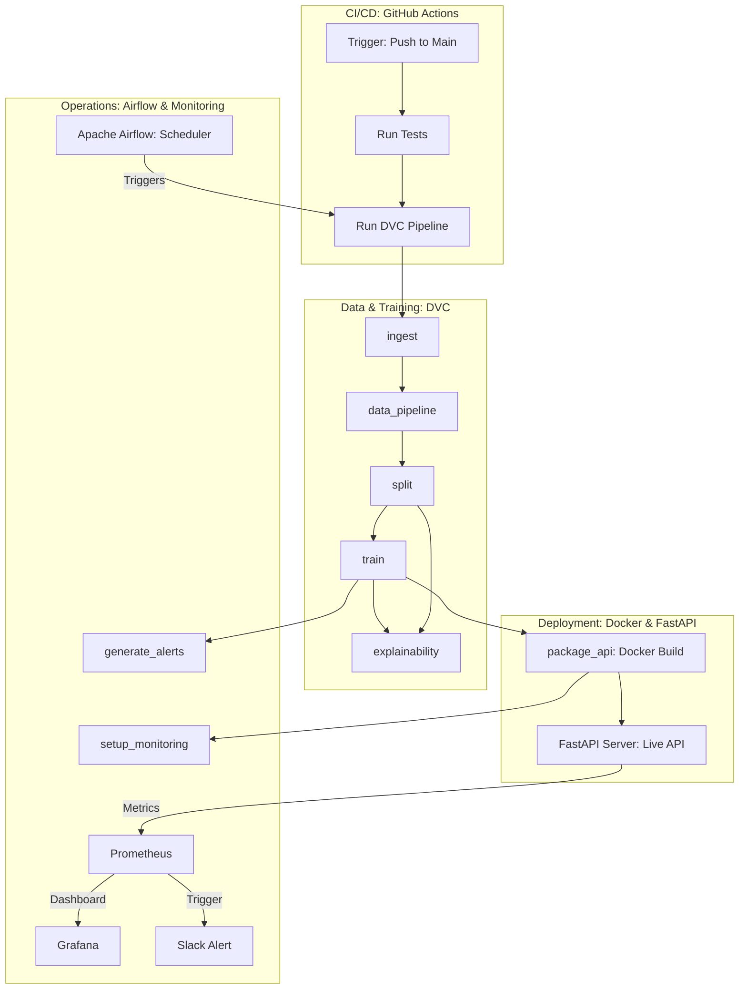

# Project Name

Short description of what this tool/project does.

adr-nlp
==============================

ADR-NLP MLOps Pipeline
An automated data pipeline designed to detect and process Adverse Drug Reaction (ADR) mentions in medical reviews. This project implements a modular architecture for data ingestion, cleaning, and model training using ClinicalBioBERT.

 Key Features
 
GCS Ingestion: Automated data retrieval from Google Cloud Storage (gs://adr-nlp).

Cleaning Agent: A custom text processing engine that normalises whitespace and strips noise while preserving medical punctuation essential for BERT tokenisation.

Validation: Integrated Data Validation using Great Expectations to ensure raw data schema integrity.

Experiment Tracking: Fully integrated with MLflow for tracking hyperparameters and model metrics.

XAI Ready: Includes SHAP integration for model explainability.

 Tech Stack
Language: Python 3.9+

Storage: Google Cloud Storage (GCS)

NLP: Transformers (ClinicalBioBERT), Pandas, Regex

MLOps: MLflow, DVC (Data Version Control)

Validation: Great Expectations

📁 Pipeline Workflow
Ingestion: Pulls drugsComTrain_raw.csv from GCS to data/raw/.
Cleaning: CleaningAgent processes the review column based on pipeline.yaml toggles.
Validation: Checks data quality before passing to the split stage.
Splitting: Partitions data into Train, Val, and Test sets.
Versioning: Processed splits are uploaded back to GCS for versioned training access.
⚙️ Configuration
Modify configs/pipeline.yaml to toggle pipeline stages:
yaml
pipeline:
  run_data: true        # Ingest & Process
  run_training: true    # BioBERT Training
  run_xai: true         # SHAP Explanations

  


Project Organization
------------

    ├── LICENSE
    ├── Makefile           
    ├── README.md          
    ├── data
    │   ├── external       
    │   ├── interim        
    │   ├── processed      
    │   └── raw            
    │
    ├── docs               
    │
    ├── models             <- Trained and serialized models, model predictions, or model summaries
    │
    ├── notebooks          <- data exploration in kaggle and colab with GPU accelerator for training, building and evaluating ADR-prediction model
    │
    ├── references         
    │
    ├── reports            
    │   └── figures       
    │
    ├── requirements.txt   < generated with `pip freeze > requirements.txt`
    │
    ├── setup.py           <- makes project pip installable (pip install -e .) so src can be imported
    ├── src                <- Source code for use in this project.
    │   ├── __init__.py    <- src is a Python module
    │   │
    │   ├── data           <- Scripts to download or generate data
    │   │   └── make_dataset.py
    │   │
    │   ├── features                   <- Scripts to turn raw data into features for modeling
    │   │   └── build_features.py      <-ADR labeling by enrichment model
    │   │
    │   ├── models         <- Scripts to train models and then use trained models to make
    │   │   │                 predictions
    │   │   ├── predict_model.py
    │   │   └── train_model.py
    │   │
    │   └── visualization  <- Scripts to create exploratory and results oriented visualizations
    │       └── visualize.py
    │
    └── tox.ini            <- tox file with settings for running tox; see tox.readthedocs.io


--------

<p><small>Project based on the <a target="_blank" href="https://drivendata.github.io/cookiecutter-data-science/">cookiecutter data science project template</a>. #cookiecutterdatascience</small></p>

# Project Name

Short description of what this tool does.

## 🚀 Getting Started

### 1. Prerequisites
Ensure you have Python 3.10+ installed.

### 2. Installation & Setup
```bash
# Clone the repository
git clone <repo-url>
cd <repo-name>

# Create and activate virtual environment
python -m venv .venv
source .venv/bin/activate  # On Windows use: .venv\Scripts\activate

# Install dependencies
pip install -r requirements.txt
```

### 3. Environment Variables
Copy the template file and fill in your private API keys:
```bash
cp .env.example .env
```

## 💻 How to Run
To run the main pipeline, execute:
```bash
python main.py
```


