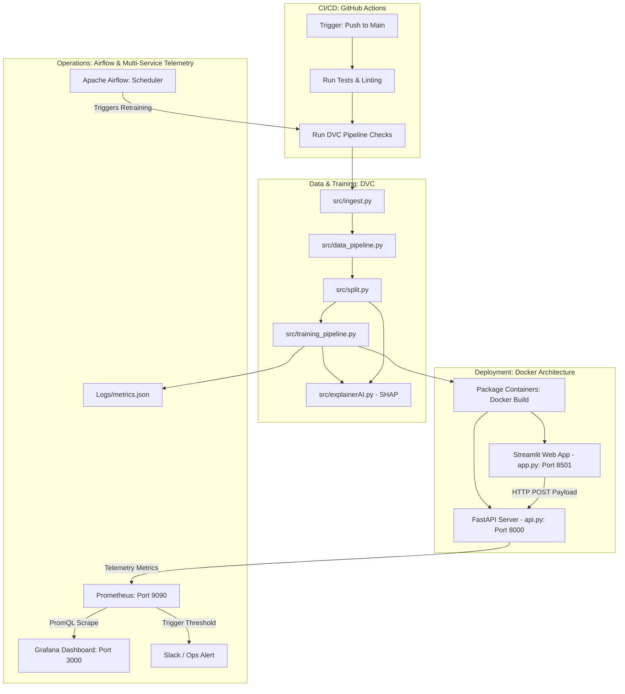

# Project Name
adr-nlp




# BioBERT Adverse Drug Reaction (ADR) Classifier 🚀

An end-to-end MLOps pipeline designed to train, track, and deploy a clinical sequence classification model (BioBERT) that detects Adverse Drug Reactions from patient reviews. 

The pipeline integrates **DVC** for data reproducibility, **MLflow** for hyperparameter tuning and model tracking, **FastAPI** for low-latency serving, **Docker** for containerization, and a **Prometheus + Grafana** stack for production telemetry monitoring with **Github Actions** automating CICD.

---

## 🚨 CRITICAL PRODUCTION SAFETY WARNING 🚨

The 200k-review production model sits in the Google Cloud Storage bucket as a compressed binary file named **`final_model.zip`**. 

**DO NOT run the training pipeline (`main.py` / `src/training_pipeline.py`) locally using default production settings.** Because the configuration file is unified, executing a training run will automatically overwrite the true production weights in GCS with your local run's outputs.

### How to Run a Safe Local Infrastructure Test:
The script features an automated Git Branch Overwrite Protection guard layer. If you execute a script outside of the `main` branch, it automatically routes uploads to a file named `final_model-test.zip`. To explicitly ensure absolute isolation during local manual modifications, open `configs/pipeline.yaml` and rename the target value:
```yaml
gcp:
  model_gcs_file: "test_dummy_model.zip" # 👈 Change this to protect production!
```

## 🛠️ Project Architecture & Layout
---
adr-nlp-mlops/
├── .github/
│   ├── workflows/
│   │   └── ci-cd.yaml              # CI/CD: Automated GitHub Actions pipeline
│   └── pull_request_template.md    # Engineering team quality checklist
├── config/                         # Central configuration schemas
│   ├── data.yaml                   # Dataset boundary specifications
│   ├── pipeline.yaml               # Main GCP, MLflow, and local path variables
│   └── prometheus.yaml             # Telemetry: Metrics scraping definitions
├── data/                           # Local storage volumes (Ignored by Git)
│   ├── dummy/                      # 20-review safe validation seed files
│   ├── processed/                  # Cleansed and partitioned data arrays
│   └── raw/                        # Raw unescaped target reviews
├── docs/                           # Automated Sphinx codebase documentation
├── gx/                             # Great Expectations Data Quality Layer
│   ├── checkpoints/                # Schema testing validation manifests
│   ├── expectations/               # JSON asset data property assertions
│   └── great_expectations.yml      # Framework global configuration file
├── logs/
│   └── metrics.json                # Evaluation stats monitored by DVC
├── mlruns/                         # Local experiment database folder
├── models/
│   └── adr-nlp-final/              # Destination for unpacked model shards at API boot
├── notebooks/                      # Experimental research Jupyter notebooks
├── references/                     # Explanatory operational training manuals
├── reports/                        # Visual output charts and static figures
├── src/                            # System core python package modules
│   ├── __init__.py
│   ├── api.py                      # FastAPI live prediction serving engine
│   ├── build_features.py           # Feature engineering orchestration logic
│   ├── cleaning_agent.py           # Text cleaning and normalisation algorithms
│   ├── config_loader.py            # Dynamic absolute path configuration parser
│   ├── data_pipeline.py            # Sequence execution controller
│   ├── explainerAI.py              # SHAP model explainability (XAI) backend
│   ├── gcs_utils.py                # Cloud storage download/upload streams
│   ├── ge_expectations.py          # Great Expectations suite generator
│   ├── ge_validator.py             # Verification runtime checkpoint runner
│   ├── ingest.py                   # Remote dataset ingestion target gateway
│   ├── orchestrator.py             # Pipeline master structural workflow manager
│   ├── split.py                    # Partitions clean arrays reproducibly
│   └── training_pipeline.py        # RAM-optimized training loop controller
├── tests/                          # Automated code verification suites
│   ├── __init__.py
│   ├── test_api.py                 # Unit assertions for mock FastAPI responses
│   ├── test_cleaning_agent.py      # Checks string cleaning normalization
│   └── test_trainer.py             # Validates model structural initialization
├── .cookiecutter.json              # Cookiecutter template deployment metadata
├── .dvcignore                      # Prevents local data cache bleeding into cloud
├── .gitignore                      # Strips local caches (venv, egg-info, pycache)
├── app.py                          # Streamlit frontend user interface webpage
├── cookiecutter.json               # Core template variable definitions
├── Dockerfile                      # Isolated backend container assembly instructions
├── Dockerfile.frontend             # Isolated frontend container assembly instructions
├── docker-compose.yaml             # API + Monitoring multi-container coordinator
├── dvc.lock                        # Frozen state snapshot of executed DVC pipelines
├── dvc.yaml                        # Reproducible pipeline step configurations
├── main.py                         # Project entry point execution script
├── Makefile                        # Standardized terminal command shortcuts
├── params.yaml                     # Central model parameter definition track
├── requirements.txt                # Unified software framework dependencies list
├── setup.py                        # Local editable package installation anchor
├── test_environment.py             # Baseline hardware compatibility checking script
└── tox.ini                         # Multi-environment automation checke
---

## 🚀 Getting Started (Local Setup)

### 1. Prerequisites
* Python 3.10+ installed.
* Google Cloud CLI installed and authenticated (`gcloud auth login`).
* Docker and Docker Compose installed locally.

### 2. Installation
Clone the repository and initialize your environment variables:
```bash
# Clone the repository
git clone <https://github.com/ark-987/adr-nlp-mlops>
cd adr-nlp-mlops

# Create and activate virtual environment
python -m venv venv
source venv/bin/activate  # On Windows: .\venv\Scripts\activate

# Configure Python pathing lookup engine
\$env:PYTHONPATH="."       # On Mac/Linux: export PYTHONPATH="."

# Install dependencies
pip install -r requirements.txt
```

---

## ⚙️ Pipeline Elements

### Phase 1: Data Ingestion & Quality Gates
* **`src/ingest.py`**: Pulls the raw dataset (drugsComTrain_raw.csv) from remote targets (GCS to data/raw/) directly into storage volumes.
* **`src/ge_expectations.py` & `src/ge_validator.py`**: Implements **Great Expectations** schemas to enforce rigorous data quality checks, ensuring schemas, null values, and feature profiles match expectations before any computations run.

toggle
pipeline.yaml:
  run_data: true        # Ingest & Process
  run_training: true    # BioBERT Training
  run_xai: true         # SHAP Explanations
### Phase 2: Feature Engineering & Preprocessing
* **`src/cleaning_agent.py`**: Standardizes text elements by stripping noise characters and unescaped strings.
* **`src/build_features.py` & `src/data_pipeline.py`**: Coordinates the mapping of text samples through clinical Named Entity Recognition (NER) models using low batch constraints to optimize local system thresholds.
* **`src/split.py`**: Programmatically segments the clean dataset into reproducible train, validation, and test datasets.

### Phase 3: Hyperparameter Search & Cloud Tracking (`src/training_pipeline.py`)
* Automatically optimizes training arguments via **Optuna** to isolate top-performing learning weights.
* Streams parameter distributions and training metrics directly to your cloud **MLflow Tracking Server**.
* **Zero-Local-Disk Fix**: Streams final model binary structures directly out of your system RAM over the network to the cloud registry, completely bypassing local hard drive volume thresholds.
* **`src/explainerAI.py`**: Executes post-training SHAP value analysis to log Explainable AI (XAI) feature importance maps directly to your monitoring layers.

### Phase 4: Local Quality Auditing (DVC Layer)
* A physical copy of test evaluation statistics is printed into `logs/metrics.json`.
* Run terminal audits to compare historical iterations directly through Git hashes:
  ```bash
  dvc metrics show
  ```

---

## 💻 Production Serving (`src/api.py`)

The deployment script operates completely independently of raw dataset parsing. When the server fires up, it loads directly from the production cloud assets.

### 1. Start the API Server Locally
```bash
python src/api.py
```
* On boot, the server calls **`src/gcs_utils.py`** to download `final_model.zip` straight from your GCS bucket, unpacks it into memory/temp space, and spins up a local web server at `http://127.0.0.1:8000`.

### 2. Test an API Prediction
Send a sample text string to the serving endpoint via a terminal POST request:
```bash
curl -X 'POST' \
  'http://127.0.0' \
  -H 'Content-Type: application/json' \
  -d '{"review": "Experiencing severe muscle pain and dizziness after taking this medication."}'
```

---

## 🐋 Containerization & Multi-Service Telemetry (Docker)

To ensure structural consistency across staging and production environments, the serving layer is packaged alongside operational monitoring tools.

### 1. Build and Launch the Stack
Run Docker Compose from the root directory to spin up the FastAPI service, Prometheus, and Grafana simultaneously:
```bash
docker-compose up --build -d
```

### 2. Monitoring Endpoints
* **FastAPI Service**: `http://localhost:8000`
* **Prometheus Dashboard**: `http://localhost:9090` (Scrapes application performance metrics)
* **Grafana Telemetry UI**: `http://localhost:3000` (Visualizes real-time load, API latency histograms, and exception profiles)

---


## 🔄 Automated CI/CD (GitHub Actions)

Our automated workflow file `.github/workflows/ci-cd.yaml` executes code quality and security checkpoints on every push or Pull Request:

1. **Linting & Code Quality**: Evaluates PEP8 styling guidelines across all modules using `flake8`.
2. **Unit Tests**: Runs code execution assertions using `pytest` to guarantee preprocessing functions aren't broken.
3. **Secret Scanning & SAST**: Scans the codebase automatically using `TruffleHog` to ensure no raw GCP Service Account keys or MLflow credentials are leaked, alongside static analysis to prevent insecure Python routing.
4. **Container Vulnerability Scan**: Prior to pushing, the compiled Docker layers are audited for CVEs (Common Vulnerabilities and Exposures). The build fails instantly if High or Critical system vulnerabilities are found.
5. **Automated Deployment**: Upon a successful merge to the `main` branch and passing all security gates, fresh, verified Docker images are automatically pushed to Google Artifact Registry (GAR) for live cloud rolling deployments.

---

## 👥 Code Collaboration & Pull Requests (PRs)
All feature additions or training parameter changes must be completed on an isolated branch. When pushing to GitHub, our `.github/pull_request_template.md` checklist will automatically pre-populate your description box. Ensure all unit evaluations, linting checkpoints, and security container scans pass with a green checkmark before selecting **Merge**.

